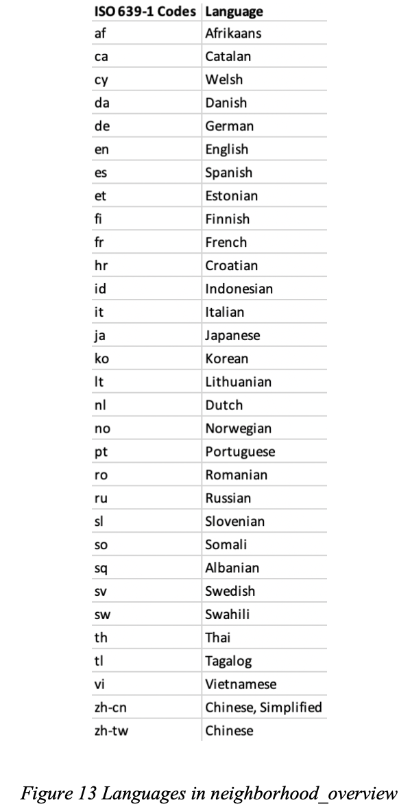
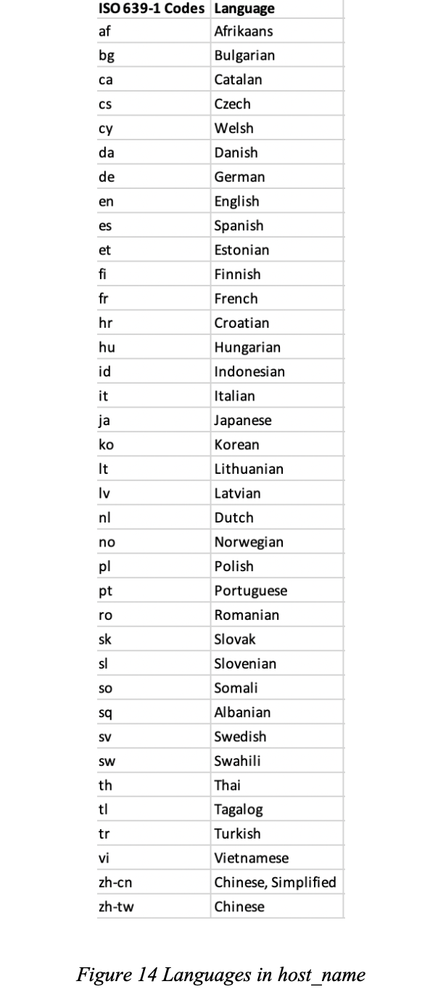
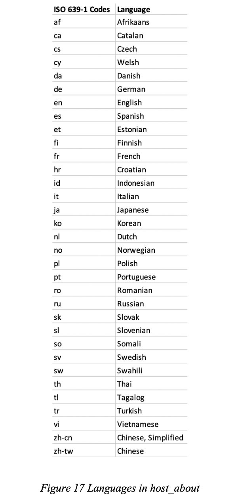
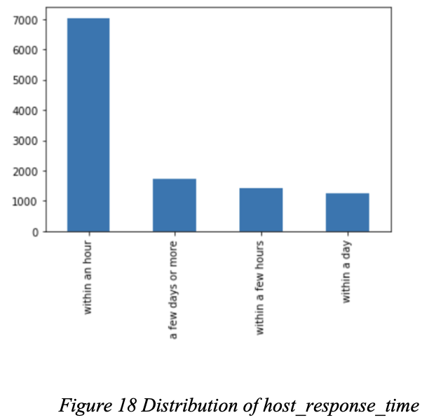
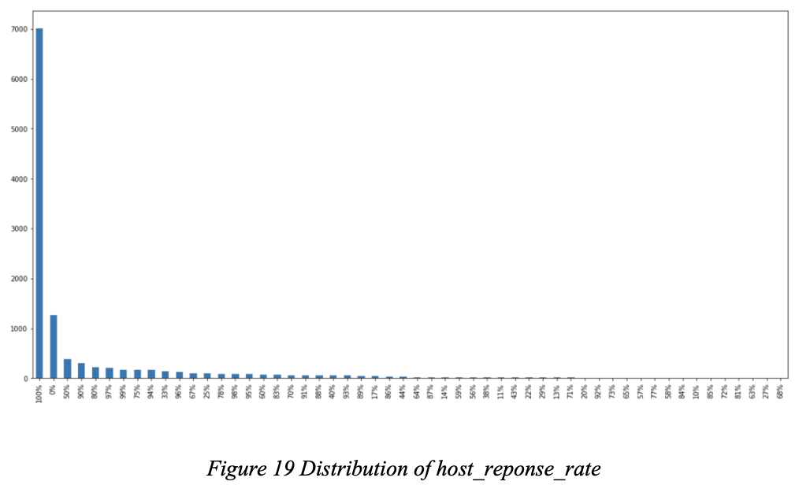
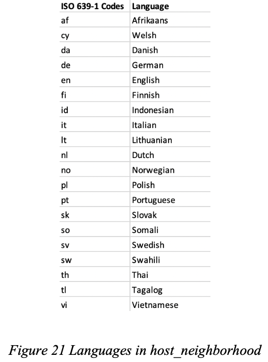
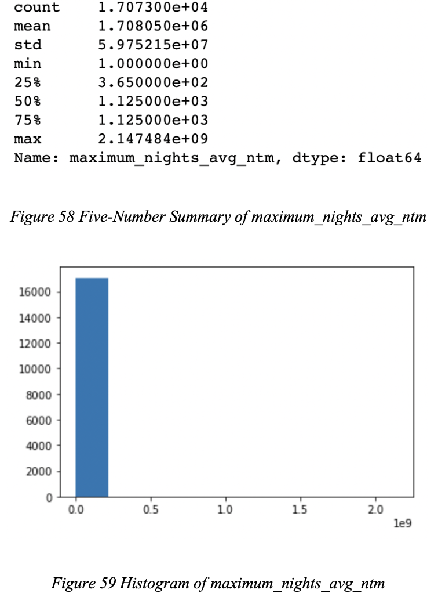

# 1. Introduction
Throughout the course of this project, I gained valuable insights on database management system and retrieval languages. In this opportunity, I embarks on journey to implement a project to design database based on AirBnB dataset provided.

---

## 1.1. Project Objective
The objective of this project is to understand the basic process of data management and retrieval in real applications and organizations, which generally covers the following tasks and procedures: collecting, processing, storing and accessing data.

---

## 1.2. Project Background
For the purpose of this project, an industrial dataset was gathered from AirBnB platform which is one of famous lodging online platform. The dataset is obtained from website [http://insideairbnb.com/get-the-data/](http://insideairbnb.com/get-the-data/) for Bangkok, Central Thailand, Thailand. 

From this dataset, few processes are involved such as knowing the inherent properties of the data, cleaning the dataset, generating derivative relations, storing data in both relational and non-relational database systems, and retrieving data so as to answer few samples of user queries.

--- 

# 2. Data Analysis
Having introduced about the project background, next step is to explore dataset semantics and structures which will be elaborated in details in this section.

---

## 2.1. Dataset Background
This group is given an AirBnB dataset in the region of Bangkok, Central Thailand, Thailand from [http://insideairbnb.com/get-the-data/](http://insideairbnb.com/get-the-data/). The dataset contains information on the listings, calendar prices, and reviews with summary information. There are five CSV files in total: calendar.csv, listings.csv, reviews.csv, listings_summary.csv and reviews_summary.csv. Since the last two files contain summary information on listings and reviews, which are already captured by listings.csv and reviews.csv, pertaining to the needs of this project, these two files are not analyzed in this and following sections. 

The calendar.csv gives the daily price of listings, and it has 6,231,645 rows and 7 attributes; the reviews.csv shows the review comments of listings, and it has 246,644 rows and 6 attributes; the listings.csv provides detailed information on listings including the host information, and it has 17,074 rows and 74 attributes.

---

## 2.2. Dataset Semantic and Structure
In this section, the three CSV files, calendar.csv reviews.csv and listings.csv, are going to be analyzed. First, their structure and semantics would be examined through meaning of each attribute, relationship between multiple tables and suggestion on potential primary keys and foreign keys.

Also, each data attribute are going to be explored through data type, domain, size or dictionary size of text data, volume, range, distribution and languages in text. In particular, the data types are determined first through Python codes, and with further examination of the attributes, advices are given on which data types to store the attributes in MySQL database. With the analysis on the attributes, especially with their ranges, constraints can be pointed out, and potential primary keys and foreign keys can be identified.

---

### 2.2.1. calendar.csv
The attributes and their meanings are as follows:
- **listing_id**: Listing ID of the AirBnB housing
- **date**: The date in the listing's calendar
- **available**: It determines whether the listing is available for booking at that date
- **price**: The price listed of the housing at that date
- **adjusted_price**: Adjusted price of the housing at that date, dynamic pricing
- **minimum_nights**: The minimum nights for a booking made on this day
- **maximum_nights**: The maximum nights for a booking made on this day

A summary of data types is as follows:
- **listing_id**: Integer data type. Might convert to varchar(18) in SQL
- **date**: String data type. Might convert to date type in SQL
- **available**: String data type. Might convert to char(1) in SQL
- **price**: String data type. Might convert to float(1) in SQL
- **adjusted_price**: String data type. Might convert to float(1) in SQL
- **minimum_nights**: Float data type. Can float(1) in SQL
- **maximum_nights**: Float data type. Can float(1) in SQL

The data attributes are then analyzed as follows:
- **listing_id**: There are 17,073 unique listing IDs. The maximum number of digits of the listing ID is 18 digits.
- **date**: The date ranges from June 20, 2022 to June 20, 2023. While examining individual listing’s association with different dates, it shows that some listings have daily price for all days during the year span while others are not.
- **available**: There are two levels for available: t and f, corresponding to the availability of the listing on a particular date. There are 4,329,257 rows with t and 1902388 rows with f.
- **price**: The price ranges from $252.0 to $1500000.0 with a median of $1,215.0. Together with five-number summary and histogram of price in Figure 1 and Figure 2, it indicates that most of the prices are low, with a few very high prices that makes the distribution of price highly skewed to the right.

- **adjusted_price**: The adjusted price ranges from $165.0 to $1,500,000.0, with a median of $1,200.0. There are 333,341 rows with adjusted price different from the listed price. 329,672 rows have higher price than adjusted price, which is 98.9% of the time the host will set a lower adjusted price; 3,669 rows have lower price than adjusted price, which is 1.1% of the time the host will set a higher adjusted price. The maximum price increase is $20,000.0, and the maximum price decrease is $2,370.0. The distribution of the adjusted price is very similar to that of the price as shown in Figure 3 and Figure 4 through five-number summary and histogram.

- **minimum_nights**: The minimum nights a guest can book on a particular date ranges from 1 day to 1,125 days, with a median of 1 day. Out of the 6,231,465 rows, there are 3,468,431 rows with minimum nights of 1 day, which is 55.7% of the rows. Most of the listings have small minimum nights requirement, but there are some with around 200 days and 400 days and few even higher, which leads to a highly skewed to the right distribution. The five-number summary and histogram of minimum nights is shown in Figure 5 and Figure 6.

- **maximum_nights**: The maximum nights a guest can book on a particular date ranges from 1 day to 2,147,483,647 days. Examining the quantiles through Figure 7 reveals a highly skewed to the right distribution, and the same result is shown in the histogram in Figure 8.

The attribute constraints, potential primary keys and foreign keys are as follows:
- primary key (listing_id, date)
- check (available in ('t', 'f')): to ensure available only has two levels
- check (price > 0)
- check (adjusted_price > 0)
- check (minimum_nights >= 1)
- check (maximum_nights >= 1)
- foreign key(listing_id) references listings(id) (will be touched on later)

---

### 2.2.2. reviews.csv
The attributes and their meanings are as follows:
- **listing_id**: Listing ID of the AirBnB housing, same as listing_id in calendar.csv
- **id**: The review's ID
- **date**: The date of the review
- **reviewer_id**: The reviewer's ID
- **reviewer_name**: The reviewer's name
- **comments**: The review's comment

A summary of data types is as follows:
- **listing_id**: Integer data type. Might convert to varchar(18) in SQL
- **id**: Integer data type. Might convert to varchar(18) in SQL
- **date**: String data type. Might convert to date type in SQL
- **reviewer_id**: Integer data type. Might convert to varchar(9) in SQL
- **reviewer_name**: String data type. Might convert to varchar(42) in SQL,length may need to increase
- **comments**: String data type. Might convert to varchar(6577) in SQL, length may need to increase

The data attributes are then analyzed as follows:
- **listing_id**: There are 10,012 unique listing IDs. The maximum number of digits of the listing ID is 18 digits. All listing IDs in reviews.csv are in calendar.csv.
- **id**: All reviews’ IDs are unique. The maximum number of digits of the ID is
18** digits.
- **date**: The reviews spans from February 09, 2011 to June 21, 2022. Comparing
with the dates from calendar.csv, there is not much overlapping: only June 20 and June 21 of the year 2022 are in calendar.csv. In total, there are only 41 reviews on left on these two dates. In addition, the review date is not necessarily a leave date or occupying date of the reviewer’s stay at the listing. Figure 9 below shows a distribution of the number of review by year. It can be seen that the distribution follows a bell shape: most of the reviews were left in the year of 2017 to 2020. This is somewhat aligned with the growth of AirBnB during those years.

- **reviewer_id**: There are 210,367 unique reviewer IDs. Comparing with the 246,644 rows in reviews.csv, there are reviews left by the same reviewer, either for the same listing or different listing (240,229 reviews with different listing and reviewer), on the same date or not (246,613 reviews with different listing, reviewer and date).
- **reviewer_name**: The maximum number of characters for reviewer’s name is 42 characters. There are 43 different languages in the reviewer’s name, where the language detection is done using python package langdetect. The detection returns a list of languages in ISO 639-1 codes (“List of ISO 639-1 codes,” 2022), where their corresponding languages are shown in Figure 10.

- **comments**: The maximum number of characters for reviewer’s name is 6,577 characters. There are 44 languages used in comments, including all of the 43 languages used in reviewer’s name plus Urdu.

The attribute constraints, potential primary keys and foreign keys are as follows: • primary key(id)
- foreign key(listing_id) references listings(id) (will be touched on later)

---

### 2.2.3. listings.csv
The attributes and their meanings are as follows, mostly referring to dataset dictionary from Inside AirBnB (Inside AirBnB Data Dictionary, 2022):
- **id**: Listing ID of the AirBnB housing, same as listing_id in calendar.csv and reviews.csv
- **listing_url**: The URL of the AirBnB housing
- **scrape_id**: The web scraping ID
- **last_scraped**: The date and time in UTC format at which a particular listing was scraped
- **name**: The name of the listing
- **description**: The detailed description of the listing
- **neighborhood_overview**: The host's description of the neighborhood
- **picture_url**: The URL to the AirBnB hosted regular sized image for the listing (i.e. the first image of the listing)
- **host_id**: AirBnB's unique identifier for the host/user
- **host_url**: The host's AirBnB page
- **host_name**: The name of the host, usually just the first name
- **host_since**: The date the host/user was created. For hosts that are AirBnB guests this could be the date they registered as a guest. i.e. the date the host joined AirBnB as a host or a guest
- **host_location**: The host's self-reported location
- **host_about**: The host's self-description
- **host_response_time**: The average amount of time that the host took to respond to all new messages in the past 30 days (past 30 days with respect to the listing's scarped date)
- **host_response_rate**: The percentage of new enquiries and reservation requests the host responded to (by either accepting/pre-approving or declining) within 24 hours in the past 30 days (What are response rate and response time and how are they calculated?)
- **host_acceptance_rate**: The rate at which the host accepts booking requests
- **host_is_superhost**: This describes whether the host is a superhost
- **host_thumbnail_url**: The host's profile picture on the listing page, displayed small
- **host_picture_url**: The host's profile picture on the airbnb page, displayed medium
- **host_neighbourhood**: The neighbourhood the host lives in. This information is not on host's page and listing page
- **host_listings_count**: The number of listings the host has (per AirBnB calculations)
- **host_total_listings_count*8: The number of listings the host has (per AirBnB calculations).
- **host_verifications**: This describes the means of host identity confirmation.
- **host_has_profile_pic**: This describes whether the host has a profile picture
- **host_identity_verified**: This describes whether the host's identity has been verified by AirBnB (Verifying your identity)
- **neighbourhood**: The neighbourhood of the listing
- **neighbourhood_cleansed**: The neighbourhood as geocoded using the latitude and longitude against neighbourhoods as defined by open or public digital shapefiles
- **neighbourhood_group_cleansed**: The neighbourhood group as geocoded using the latitude and longitude against neighbourhoods as defined by open or public digital shapefiles
- **latitude**: The latitude of the listing, uses the World Geodetic System (WGS84) projection for latitude and longitude
- **longitude**: The longitude of the listing, uses the World Geodetic System (WGS84) projection for latitude and longitude
- **property_type**: The host’s self-selected property type. Hotels and Bed and Breakfasts are described as such by their hosts in this field
- **room_type**: The room type of the listing (Types of places to stay)
- **accommodates**: The maximum capacity of the listing
- **bathrooms**: The number of bathrooms in the listing
- **bathrooms_text**: The textual description of the number of bathrooms in the listing
- **bedrooms**: The number of bedrooms
- **beds**: The number of bed(s)
- **amenities**: The list of amenities the place offers
- **price**: The daily price in local currency
- **minimum_nights**: The minimum number of night stay for the listing
- **maximum_nights**: The maximum number of night stay for the listing
- **minimum_minimum_nights**: The smallest minimum_nights value from the calendar (looking 365 nights in the future)
- **maximum_minimum_nights**: The largest minimum_nights value from the calendar (looking 365 nights in the future)
- **minimum_maximum_nights**: The smallest maximum_nights value from the calendar (looking 365 nights in the future)
- **maximum_maximum_nights**: The largest maximum_nights value from the calendar (looking 365 nights in the future)
- **minimum_nights_avg_ntm**: The average minimum_nights value from the calendar (looking 365 nights in the future)
- **maximum_nights_avg_ntm**: The average maximum_nights value from the calendar (looking 365 nights in the future)
- **calendar_updated**: Empty column
- **has_availability**: This describes whether the listing is available based on the following four columns (i.e. in the next 365 days).
- **availability_30**: The availability of the listing 30 days in the future as determined by the calendar. Note a listing may not be available because it has been booked by a guest or blocked by the host
- **availability_60**: The availability of the listing 60 days in the future as determined by the calendar. Note a listing may not be available because it has been booked by a guest or blocked by the host
- **availability_90**: The availability of the listing 90 days in the future as determined by the calendar. Note a listing may not be available because it has been booked by a guest or blocked by the host
- **availability_365**: The availability of the listing 365 days in the future as determined by the calendar. Note a listing may not be available because it has been booked by a guest or blocked by the host
- **calendar_last_scraped**: The date the listing's calendar was last scraped
- **number_of_reviews**: The number of reviews the listing has
- **number_of_reviews_ltm**: The number of reviews the listing has (in the last 12 months)
- **number_of_reviews_l30d**: The number of reviews the listing has (in the last 30 days)
- **first_review**: The date of the first/oldest review 
- **last_review**: The date of the last/newest review
- **review_scores_rating**: The overall score rating of the listing by all reviews, out of 5
- **review_scores_accuracy**: The accuracy score for the listing by all reviews, out of 5
- **review_scores_cleanliness**: The cleanliness score for the listing by all reviews, out of 5
- **review_scores_checkin**: The check-in score for the listing by all reviews, out of 5
- **review_scores_communication**: The communication score for the listing by all reviews, out of 5
- **review_scores_location**: The location score for the listing by all reviews, out of 5
- **review_scores_value**: The value score for the listing by all reviews, out of 5
- **license**: The licence/permit/registration number
- **instant_bookable**: This describes whether the guest can automatically book the listing without the host requiring to accept their booking request. An indicator of a commercial listing
- **calculated_host_listings_count**: The number of listings the host has in the current scrape, in the city/region geography
- **calculated_host_listings_count_entire_homes**: The number of Entire home/apt listings the host has in the current scrape, in the city/region geography
- **calculated_host_listings_count_private_rooms**: The number of Private room listings the host has in the current scrape, in the city/region geography
- **calculated_host_listings_count_shared_rooms**: The number of Shared room listings the host has in the current scrape, in the city/region geography
- **reviews_per_month**: The number of reviews the listing has over the lifetime of the listing (in months)

A summary of data types is as follows:
- **id**: Integer data type. Might convert to varchar(18) in SQL
- **listing_url**: String data type. Might convert to varchar(2,048) in SQL. 2,048 characters is the conventional max length for URL
- **scrape_id**: Integer data type. Might delete this row in SQL
- **last_scraped**: String data type. Might convert to date type in SQL
- **name**: String data type. Might convert to varchar(255) in SQL, length may need to increase
- **description**: String data type. Might convert to varchar(1,000) in SQL, length may need to increase
- **neighborhood_overview**: String data type. Might convert to varchar(1,000) in SQL, length may need to increase
- **picture_url**: String data type. Might convert to varchar(2,048) in SQL. 2,048 characters is the conventional max length for URL
- **host_id**: Integer data type. Might convert to varchar(9) in SQL
- **host_url**: String data type. Might convert to varchar(2,048) in SQL. 2,048 characters is the conventional max length for URL
- **host_name**: String data type. Might convert to varchar(35) in SQL, length may need to increase
- **host_since**: String data type. Might convert to date type in SQL 
- **host_location**: String data type. Might convert to varchar(125) in SQL, length may need to increase
- **host_about**: String data type. Might convert to varchar(5893) in SQL, length may need to increase
- **host_response_time**: String data type. Might convert to varchar(18) or int in SQL. int based on James' note to handle missing values
- **host_response_rate**: String data type. Might convert to int in SQL. % to whitespace according to James' note
- **host_acceptance_rate**: String data type. Might convert to int in SQL. % to whitespace according to James' note
- **host_is_superhost**: String data type. Might convert to char(1) in SQL
- **host_thumbnail_url**: String datat type. Might convert to varchar(2,048) in SQL. 2,048 characters is the conventional max length for URL
- **host_picture_url**: String data type. Might convert to varchar(2,048) in SQL. 2,048 characters is the conventional max length for URL
- **host_neighbourhood**: String data type. Might convert to varchar(28) in SQL, length may need to increase
- **host_listings_count**: Float data type. Can set float(1) in SQL
- **host_total_listings_count**: Float data type. Might delete this row in SQL
- **host_verifications**: String data type. Might convert to varchar(32) in SQL
- **host_has_profile_pic**: String data type. After imputing the missing values, might convert to char(1) in SQL
- **host_identity_verified**: String data type. After imputing the missing values, might convert to char(1) in SQL
- **neighbourhood**: String data type. Might convert to varchar(80) in SQL, length may need to increase
- **neighbourhood_cleansed**: String data type. Might convert to char(20) in SQL
- **neighbourhood_group_cleansed**: Float data type. All empty values, might delete this row in SQL
- **latitude**: Float data type. Might convert to float(5) in SQL
- **longitude**: Float data type. Might convert to float(5) in SQL
- **property_type**: String data type. Might convert to varchar(34) in SQL
- **room_type**: String data type. Might convert to varchar(15) in SQL
- **accommodates**: Integer data type
- **bathrooms**: Float data type. All empty values, might delete this row in SQL
- **bathrooms_text**: String data type. Might convert to varchar(17) in SQL
- **bedrooms**: Float data type. Might convert to float(1) in SQL
- **beds**: Float data type. Might convert to float(1) in SQL
- **amenities**: String data type. Might convert to varchar(1606) in SQL
- **price**: String data type. Might convert to float(1) in SQL
- **minimum_nights**: Integer data type.
- **maximum_nights**: Integer data type.
- **minimum_minimum_nights**: Float data type. Might convert to float(1) in SQL
- **maximum_minimum_nights**: Float data type. Might convert to float(1) in SQL
- **minimum_maximum_nights**: Float data type. Might convert to float(1) in SQL
- **maximum_maximum_nights**: Float data type. Might convert to float(1) in SQL
- **minimum_nights_avg_ntm**: Float data type. Might convert to float(1) in SQL
- **maximum_nights_avg_ntm**: Float data type. Might convert to float(1) in SQL
- **calendar_updated**: Float data type. All empty values, might delete this row in SQL
- **has_availability**: String data type. Might convert to char(1) in SQL
- **availability_30**: Integer data type.
- **availability_60**: Integer data type.
- **availability_90**: Integer data type.
- **availability_365**: Integer data type.
- **calendar_last_scraped**: String data type. Might convert to date type in SQL
- **number_of_reviews**: Integer data type.
- **number_of_reviews_ltm**: Integer data type
- **number_of_reviews_l30d**: Integer data type.
- **first_review**: Float data type. Might convert to date type in SQL
- **last_review**: Float data type. Might convert to date type in SQL
- **review_scores_rating**: Float data type. Can set float(1) in SQL
- **review_scores_accuracy**: Float data type. Can set float(1) in SQL
- **review_scores_cleanliness**: Float data type. Can set float(1) in SQL
- **review_scores_checkin**: Float data type. Can set float(1) in SQL
- **review_scores_communication**: Float data type. Can set float(1) in SQL
- **review_scores_location**: Float data type. Can set float(1) in SQL
- **review_scores_value**: Float data type. Can set float(1) in SQL
- **license**: Float data type. All empty values, might delete this row in SQL
- **instant_bookable**: String data type. Can set char(1) in SQL
- **calculated_host_listings_count**: Integer data type.
- **calculated_host_listings_count_entire_homes**: Integer data type.
- **calculated_host_listings_count_private_rooms**: Integer data type.
- **calculated_host_listings_count_shared_rooms**: Integer data type.
- **reviews_per_month**: Float data type. Can set float(2) in SQL.

The data attributes are then analyzed as follows:
- **id**: There are 17,074 unique listing IDs. The maximum length of digits is 18 digits. Since id uniquely identifies each listing, it serves the same purpose as listing_id in calendar.csv and reviews.csv. Recall that there are 17,073 unique listing IDs in calendar.csv, this suggests that there is one listing that is present in listings.csv but not in calendar.csv, which is the listing with id 13,729.
- **listing_url**: There are 17,074 unique listing URLs, which is of the same number of unique IDs of the listings. The maximum number of characters for listing’s URL is 36 characters.
- **scrape_id**: All listing has the same web scraping ID 20,220,620,202,126.
- **last_scraped**: There are two days that the AirBnB data was last scraped: June 20 and June 21 of the year 2022.
- **name**: There are duplicate names for the listings as there are only 16,089 unique names. The maximum number of characters for name is 255 characters. There are 39 different languages in the name of the listing as shown in Figure 11.

- **description**: There are duplicate description for the listings as there are only 13,298 unique listing description. The maximum number of characters for description is 1,000 characters. There are 29 different languages in the description of the listing as shown in Figure 12.

- **neighborhood_overview**: There are duplicate neighbourhood description for the listings as there are only 6002 unique neighbourhood description. The maximum number of characters for neighbourhood description is 1000 characters. There are 31 different languages in the neighbourhood description of the listing as shown in Figure 13.

- **picture_url**: There are 15,799 unique picture URLs. The maximum number of characters for the URL that hosts the first image of the listing is 122 characters.
- **host_id**: There are 7,639 unique host IDs, meaning there are 7,639 different hosts in total. The maximum number of digits for the host's ID is 9 digits.
- **host_url**: There are 7,639 unique host URLs, which is of the same number of the unique host IDs. The maximum number of characters for the host’s URL is 42 characters.
- **host_name**: There are 5,991 unique host names. Comparing the number with the number of hosts in the area, there are hosts with the same name. The maximum number of characters for the host’s name is 35 characters. There are 37 different languages in the host’s name as shown in Figure 14.

- **host_since**: The date that the host was created spans from December 02, 2009 to June 17, 2022. The distribution of the host creation date is shown in Figure 15, and it follows somewhat bimodal distribution with the highest number of host creation around the year of 2015 and 2016 and the year of 2018 and 2019.

- **host_location**: For the host location, there are 632 unique host locations. Some of the locations more detailed with district and city information while others just have country. The maximum number of characters for the host’s self- reported location is 125 characters. There are 27 different languages in the host’s location as shown in Figure 16.

- **host_about**: There are 3,305 unique host’s self-description. The maximum number of characters for the host’s self-description is 5,893 characters. There are 27 different languages in the host’s self-description as shown in Figure 17.

- **host_response_time**: The host’s response time has five levels: within an hour, within a few hours, within a day, a few days or more, nan(missing values). There are 7,033 listings with host’s response time within an hour, 1,420 listings of within a few hours, 1,252 listings of within a day, 1,740 listing of a few days or more, 5,629 of rows with missing value as shown in Figure 18. The maximum number of characters for the host’s response time is 18 characters.

- **host_response_rate**: There are 54 levels of host’s response rate. The attribute is of string data type in the csv file, but it is actually capturing numerical information. The host’s response time ranges from 0% to 100% with the majority of the listings have a host’s response rate of 100%. Figure 19 shows that the distribution of the host’s response rate is highly skewed to the right as a few listings have very low host’s response rate.

- **host_acceptance_rate**: There are 70 levels of host’s response rate. The attribute is of string data type in the csv file, but it is actually capturing numerical information. The host’s acceptance time ranges from 0% to 100% with the majority of the listings have a host’s acceptance rate of 100%. Figure 20 shows that the distribution of the host’s acceptance rate is highly skewed to the right as a few listings have very low host’s acceptance rate.

- **host_is_superhost**: There are three levels: f, t, nan(missing value). There are 15235 rows with f, 1837 rows with t and 2 rows with missing value.
- **host_thumbnail_url**: There are 7,557 unique host's profile pictures (displayed in small) on the listing page. The maximum number of characters for the host’s thumbnail URL is 106 characters.
- **host_picture_url**: There are 7,557 unique host's profile pictures (displayed in medium) on the listing page. The maximum number of characters for the host’s thumbnail URL is 109 characters.
- **host_neighbourhood**: There are 89 unique neighbourhood that the host lives in. The maximum number of characters for these neighbourhoods is 28 characters. There are 20 different languages in these neighbourhoods as shown in Figure 21.

- **host_listings_count**: The number of listings that the host has ranges from 0 listing to 422 listings with a median of 3 listings. With few very large host's listing count, its distribution is highly skewed to the right as shown in Figure 22 and Figure 23 through the five-number summary and the histogram.

- **host_verifications**: There are three ways that a host can confirm identity: phone, email and work email. Hence there are 8 levels in total: 6 combinations of the three ways, no verification and no information on the verification. There are 12,773 rows with verified email and phone, 2,168 rows with verified email, phone and work email, 1,916 rows with verified phone, 108 rows with verified phone and work email, 60 rows with no verification, 45 rows with verified email, 2 rows with verified work_email and 2 rows with no information on verification. The distribution can be seen in Figure 24. The maximum number of characters for the host’s verification is 32 characters.

- **host_has_profile_pic**: The attribute has three levels: f, t, nan(missing value). There are 16,922 rows with t, 150 rows with f and 2 rows with missing value.
- **host_identity_verified**: The attribute has three levels: f, t, nan(missing value). 16,922 rows with t, 150 rows with f and 2 rows with missing value. The host with host ID 21,348,778 has two listings in the area, and there is no information on this host except his/her host ID and URL.
- **neighbourhood**: There are 729 unique neighbourhoods of the listings. The maximum number of characters for the neighbourhood is 84 characters. There are 9 different languages for this attribute: English, Finnish, Indonesian, Dutch, Norwegian, Swahili, Thai, Tagalog, Vietnamese.
- **neighbourhood_cleansed**: After cleaning the neighbourhood data with geological information, there are now only 50 different neighbourhoods. The row counts for each neighbourhood is shown below in Figure 25, and the distribution is shown in Figure 26. The maximum number of characters for the neighbourhood is 20 characters.

- **neighbourhood_group_cleansed**: This attribute does not contain any information as it only has empty values.
- **latitude**: The latitude of the listing ranges from 13.5273 to 13.97355. The distribution has a bell-shape, which is similar to normal distribution. The five- number summary and the histogram are shown below in Figure 27 and Figure 28.

- **longitude**: The longitude of the listing ranges from 100.31062 to 100.92344. The distribution has a bell-shape, which is similar to normal distribution. The five-number summary and the histogram are shown below in Figure 29 and Figure 30.

- **property_type**: There are 86 types of property. The row counts for each property type is shown in Figure 31, and the distribution plot is in Figure 32. The most popular property type is entire rental unit, followed by entire condo. The maximum number of characters for property type is 34 characters.

- **room_type**: There are 4 room types: entire home/apt, private room, hotel room and shared room. There are 9,224 rows with entire home/apt, 6,445 rows with private room, 794 rows with hotel room and 611 rows with shared room. The distribution plot is in Figure 33. The maximum number of characters for room type is 15 characters.

- **accommodates**: The maximum capacity of the listing ranges from 0 to 16 people. Most of the listings can accommodate less or equal to 5 people, while few listings can host up to 16 guests. This leads to a right skewed distribution as shown in Figure 34 and Figure 35 by the five-number summary and histogram.

- **bathrooms**: This attribute hosts no information as it is an empty column.
- **bathrooms_text**: There are 60 different descriptions of the bathrooms. The row count for each bathroom description is shown below in Figure 36, and the distribution plot is in Figure 37. The most popular bathroom description is 1 bath, followed by 1 private bath. The maximum number of characters for bathroom’s description is 17 characters.

- **bedrooms**: The number of bedrooms that listings have ranges from 1 to 50. This leads to a very right skewed distribution as shown by the five-number summary and the histogram in Figure 38 and Figure 39. Most of the listings have 1 bedroom, while few listings have up to 50 bedrooms.

- **beds**: The number of beds that listings have ranges from 1 to 50. Most of the listings have 1 to 2 beds, while few listings have up to 50 beds. This leads to a very right skewed distribution as shown by the five-number summary and the histogram in Figure 40 and Figure 41.

- **amenities**: There are 13,880 unique description of amenities included in the listings. The maximum number of characters for amenities’ description is 1,606 characters.
- **price**: The listing’s price ranges from $0 to $1,500,000, and it does not match with the price in calendar.csv. The distribution of the price is highly skewed to the right as shown in five-number summary and the histogram in Figure 42 and Figure 43.

- **minimum_nights**: The minimum number of nights for the listing ranges from 1 to 1,125 days. Most of the listings have a minimum less or equal to 7 days. Its distribution is highly skewed to the right as shown through the five-number summary and the histogram in Figure 44 and Figure 45.

- **maximum_nights**: The maximum number of nights for the listing ranges from 1 to 100,000 days. Most of the listings have a maximum less or equal to 1,125 days. Its distribution is highly skewed to the right as shown through the five- number summary and the histogram in Figure 46 and Figure 47.

- **minimum_minimum_nights**: The smallest minimum nights of the listing (looking 365 nights in the future in calendar) ranges from 1 to 1,125 days. Most of the listings have a minimum less or equal 7 days. Its distribution is highly skewed to the right as shown in the five-number summary and the histogram in Figure 48 and Figure 49. There are 16,793 listings that have the same value of smallest minimum nights value from the calendar (looking 365 nights in the future) with their current minimum nights value.

- **maximum_minimum_nights**: The largest minimum nights of the listing (looking 365 nights in the future in calendar) ranges from 1 to 1,125 days. Most of the listings have a minimum less or equal to 7 days. Its distribution is highly skewed to the right as shown in the five-number summary and the histogram in Figure 50 and Figure 51. There are 16,773 listings that have the same value of largest minimum_nights value from the calender (looking 365 nights in the future) with their current minimum_nights.

- **minimum_maximum_nights**: The smallest maximum nights of the listing (looking 365 nights in the future in calendar) ranges from 1 to 2,147,483,647 days. Most of the listings have a maximum less or equal to 1,125 days. Its distribution is highly skewed to the right as shown in the five-number summary and the histogram in Figure 52 and Figure 53. There are 14801 listings that have the same value of smallest maximum nights value from the calendar (looking 365 nights in the future) with their current maximum nights value.

- **maximum_maximum_nights**: The largest maximum nights of the listing (looking 365 nights in the future in calendar) ranges from 1 to 2,147,483,647 days. Most of the listings have a maximum less or equal to 1,125 days. Its distribution is highly skewed to the right as shown in the five-number summary and the histogram in Figure 54 and Figure 55. There are 14961 listings that have the same value of largest maximum nights value from the calendar (looking 365 nights in the future) with their current maximum nights value.

- **minimum_nights_avg_ntm**: The average minimum nights of the listing (looking 365 nights in the future in calendar) ranges from 1 to 1,125 days. Most of the listings have a minimum less or equal to 7 days. Its distribution is highly skewed to the right as shown in the five-number summary and the histogram in Figure 56 and Figure 57.

- **maximum_nights_avg_ntm**: The average maximum nights of the listing (looking 365 nights in the future in calendar) ranges from 1 to 2,147,483,647 days. Most of the listings have a maximum less or equal to 1,125 days. Its distribution is highly skewed to the right as shown in the five-number summary and the histogram in Figure 58 and Figure 59.

- **calendar_updated**: This attribute does not contain any information since this is an empty column.
- **has_availability**: This attribute has two levels: t and f, corresponding to whether the listing has availability or not in the next 365 days. There are 17,004 listings with availability in the next 365 days based on calendar, and 70 listings not.
- **availability_30**: The availability of the listing in the next 30 days ranges from 0 to 30 days. With a median of 29 days and a third quartile of 30 days, most of the listings have around 30 days of availability in the next 30 days. The five- number summary and the histogram of the attribute are shown below in Figure 60 and Figure 61.

- **availability_60**: The availability of the listing in the next 60 days ranges from 0 to 60 days. With a median of 59 days and a third quartile of 60 days, most of the listings have around 60 days of availability in the next 60 days. The five- number summary and the histogram of the attribute are shown below in Figure 62 and Figure 63.

- **availability_90**: The availability of the listing in the next 90 days ranges from 0 to 90 days. With a median of 89 days and a third quartile of 90 days, most of the listings have around 90 days of availability in the next 90 days. The five- number summary and the histogram of the attribute are shown below in Figure 64 and Figure 65.

- **availability_365**: The availability of the listing in the next 365 days ranges from 0 to 365 days. With a median of 328 days and a third quartile of 365 days, most of the listings have around 365 days of availability in the next 365 days, with few around 0 days, 100 days and 150 days. The five-number summary and the histogram of the attribute are shown below in Figure 66 and Figure 67.

- **calendar_last_scraped**: The calendar was last scraped on June 20 and June 21 of the year 2022. There are 14,753 listings that were scraped on June 20, 2022, and 2321 listings were scraped on June 21, 2022.
- **number_of_reviews**: The number of reviews the listing has ranges from 0 to 1,119 reviews. Most of the listings have less than 10 reviews, but few can up have to 1,119 reviews based on the result from the five-number summary and the histogram of attribute shown in Figure 68 and Figure 69. The distribution is highly skewed to the right.

- **number_of_reviews_ltm**: The number of reviews the listing has in the last 12 months ranges from 0 to 112 reviews. Most of the listings have 0 reviews in the last year, but few can up have to 112 reviews based on the result from the five-number summary and the histogram of attribute shown in Figure 70 and Figure 71. The distribution is highly skewed to the right.

- **number_of_reviews_l30d**: The number of reviews the listing has in the last 30 days ranges from 0 to 23 reviews. Most of the listings have 0 reviews in the last 30 days, but few can up have to 23 reviews based on the result from the five-number summary and the histogram of attribute shown in Figure 72 and Figure 73. The distribution is highly skewed to the right.

- **first_review**: The date of the first review spans from February 09, 2011 to June 21, 2022. There are 10,012 listings with information on the first review’s date.
- **last_review**: The date of the last review spans from December 15, 2012 to June 21, 2022. There are 10,012 listings with information on the last review’s date, and there are 1,873 listings with same first review and last review date.
- **review_scores_rating**: The overall score rating of the listing by all reviews ranges from 0 to 5. From the five-number summary and the histogram of the attribute in Figure 74 and Figure 75, most of the listings have score of 4 and above, and the distribution is highly skewed to the left.

- **review_scores_accuracy**: The accuracy score rating of the listing by all reviews ranges from 0 to 5. Only 9,786 listings out of the 10,012 listings that have reviews have review score for accuracy. From the five-number summary and the histogram of the attribute in Figure 76 and Figure 77, most of the listings have score of 4 and above, and the distribution is highly skewed to the left.

- **review_scores_cleanliness**: The cleanliness score rating of the listing by all reviews ranges from 0 to 5. Only 9,786 listings out of the 10,012 listings that have reviews have review score for cleanliness. From the five-number summary and the histogram of the attribute in Figure 78 and Figure 79, most of the listings have score of 4 and above, and the distribution is highly skewed to the left.

- **review_scores_checkin**: The check-in score rating of the listing by all reviews ranges from 0 to 5. Only 9,780 listings out of the 10,012 listings that have reviews have review score for check-in. From the five-number summary and the histogram of the attribute in Figure 80 and Figure 81, most of the listings have score of 4 and above, and the distribution is highly skewed to the left.

- **review_scores_communication**: The communication score rating of the listing by all reviews ranges from 0 to 5. Only 9,785 listings out of the 10,012 listings that have reviews have review score for communication. From the five- number summary and the histogram of the attribute in Figure 82 and Figure 83, most of the listings have score of 4 and above, and the distribution is highly skewed to the left.

- **review_scores_location**: The location score rating of the listing by all reviews ranges from 0 to 5. Only 9,779 listings out of the 10,012 listings that have reviews have review score for location. From the five-number summary and the histogram of the attribute in Figure 84 and Figure 85, most of the listings have score of 4 and above, and the distribution is highly skewed to the left.

- **review_scores_value**: The value score rating of the listing by all reviews ranges from 0 to 5. Only 9,778 listings out of the 10,012 listings that have reviews have review score for value. From the five-number summary and the histogram of the attribute in Figure 86 and Figure 87, most of the listings have score of 4 and above, and the distribution is highly skewed to the left.

- **license**: This attribute contains no information since it is an empty column.
- **instant_bookable**: There are two levels: t and f. 11,376 listings are instant bookable while 5,698 listings are not.
- **calculated_host_listings_count**: The number of listings the host has in the current scrape ranges from 1 to 195, which is different from host_listings_count. Most of the hosts have less or equal to 11 listings, but some have up to 195 listings. The distribution is highly skewed to the right as shown by the five-number summary and the histogram in Figure 88 and Figure 89.

- **calculated_host_listings_count_entire_homes**: The number of entire home/apt listings the host has in the current scrape ranges from 0 to 195. Most of the hosts have less or equal to 5 listings of entire home/apt, but some have up to 195 listings. The distribution is highly skewed to the right as shown by the five-number summary and the histogram in Figure 90 and Figure 91.

- **calculated_host_listings_count_private_rooms**: The number of private rooms listings the host has in the current scrape ranges from 0 to 195. Most of the hosts have less or equal to 2 listings of private rooms, but some have up to 195 listings. The distribution is highly skewed to the right as shown by the five- number summary and the histogram in Figure 92 and Figure 93.

- **calculated_host_listings_count_shared_rooms**: The number of shared rooms listings the host has in the current scrape ranges from 0 to 62. Most of the hosts have less or equal to 0 listing of shared rooms, but some have up to 62 listings. The distribution is highly skewed to the right as shown by the five- number summary and the histogram in Figure 94 and Figure 95.

- **reviews_per_month**: The attribute ranges from 0.01 to 19.42. Most of the hosts have less than 1 review per month. The distribution is highly skewed to the right as shown in the five-number summary and the histogram in Figure 96 and Figure 97.

The attribute constraints, potential primary keys and foreign keys are as follows:
- primary key(id)
- listing_url not null
- host_id not null (in future separation to host table, host_id is the primary key)
- host_url not null
- check (host_is_superhost in ('t', 'f'))
- check (host_listings_count >= 0)
- check (host_total_listings_count >= 0)
- check (host_has_profile_pic in ('t', 'f'))
- check (host_identity_verified in ('t', 'f'))
- check (latitude >= 0)
- check (longitude >= 0)
- check (room_type in ('Entire home/apt', 'Private room', 'Hotel room', 'Shared room'))
- check (accommodates >= 0)
- check (bedrooms >= 1)
- check (beds >= 1)
- check (price >= 0)
- check (minimum_nights >= 1)
- check (maximum_nights >= 1)
- check (minimum_minimum_nights >= 1)
- check (maximum_minimum_nights >= 1)
- check (minimum_maximum_nights >= 1)
- check (maximum_maximum_nights >= 1)
- check (minimum_nights_avg_ntm >= 1)
- check (maximum_nights_avg_ntm >= 1)
- check (has_availability in ('t', 'f'))
- check (availability_30 >= 0)
- check (availability_60 >= 0)
- check (availability_90 >= 0)
- check (availability_365 >= 0)
- check (number_of_reviews >= 0)
- check (number_of_reviews_ltm >= 0)
- check (number_of_reviews_l30d >= 0)
- check (review_scores_rating >= 0)
- check (review_scores_accuracy >= 0)
- check (review_scores_cleanliness >= 0)
- check (review_scores_checkin >= 0)
- check (review_scores_communication >= 0)
- check (review_scores_location >= 0)
- check (review_scores_value >= 0)
- check (instant_bookable in ('t', 'f'))
- check (calculated_host_listings_count >= 1)
- check (calculated_host_listings_count_entire_homes >= 0)
- check (calculated_host_listings_count_private_rooms >= 0)
- check (calculated_host_listings_count_shared_rooms >= 0)
- check (reviews_per_month >= 0)

---

# 3. Data Processing
Upon performing in-depth data analysis in previous section, AirBnB dataset undergoes processing stage to clean unexpected data like duplicated values, inconsistent number of attributes, and presence of multiple non-English languages.

---

## 3.1. Processing Strategy
There are few strategies involved for cleaning the dataset which will be discussed in this section:
- When a particular record is null (i.e. missing), it will be replaced with value which logically making sense and following attribute data type discussed in data analysis in previous section. This is done to ensure there is no null entries on all dataset.
- Records with duplicated values signify that the table is not in BCNF form and therefore schema reduction will be performed and discussed elaborately in next section for data storing.
- For attributes which are of “free-text” in nature (e.g. ‘comments’ attribute in reviews table, ‘description’ attribute in listings table, etc), all characters that does not conform to ASCII and UTF-8 encoding will be deprecated and replaced with whitespaces. This is done to ensure data importability to database management systems with strict encoding type like MySQL. For simplification, same approach is implemented for data deployment at MongoDB.
- The presence of multiple languages in the dataset imposes difficulty for data deployment at traditional relational database management system. Therefore, non-English characters, emoticons, and any other special characters belonging to extended Unicode character set would also be replaced with whitespaces.
- Summary files such as listings_summary.csv and reviews_summary.csv only capture table snapshot of key lingtings.csv and reviews.csv files with exact same number of rows but reduced number of columns. This is why these summary files will be ignored for this project.

Based on aforementioned strategies, I will discuss my exact implementation on all attributes which are altered during data processing for each individual tables in next subsequent subsection under current Section 3.

---

## 3.2. Calendar Relation
First, I need to check if there are rows containing null values in calendar.csv through execution of below code chunk. The result prints the attribute name, data type, and the number of null records respectively. From the result below, there are 2 records under ‘minimum_nights’ and ‘maximum_nights’ columns with null values. They will be backfilled with integer 1. The output of this processed calendar would be named as 1_calendar.csv.

Next processing step for calendar relation would be to convert price attribute under calendar relation from initially string data type to float data type. There are two generic cases under price attribute here such as $870.00 and “$100,000.00” which would be converted into 870.00 and 100000.00 by getting rid of dollar sign ($), double quotation sign (“ “), and comma sign for those prices greater than 999.99 dollars. If this comma sign is not removed, they will introduce a new column in calendar relation once dollar sign and double quotation sign are removed which is not desired. See below code snippet which generates 2_calendar.csv from input 1_calendar.csv file earlier.

---

## 3.3. Transaction Relation
Transaction relation is derived from processed calendar.csv discussed previously. If I carefully take a look the records in the calendar dataset, I can see that under each listing_id, there will be a range of dates and availability status with ‘f’ indicating that the place is occupied and ‘t’ indicating that the place is available for rent.
The idea to derive transaction relation is to leverage only on two attributes from calendar, namely, dates and available. For each listing_id, I would be keeping track of checkin date and checkout date. Checkin date is defined as the date when available column turns from consecutive status ‘t’ to ‘f’, while checkout date is defined as the date when available column turns from consecutive status ‘f’ to ‘t’. Occupancy period can then be calculated by taking difference between checkin date and checkout date. If checkin date and checkout date is the same, I will assume that occupancy period is 1 day.
From above model, I proceeded to do text processing using code snippet below to read 1_calendar.csv and to generate two interim output files called 1_checkin.csv and 1_checkout.csv. Both these interim files have same set of attributes as calendar relation. The only exception is that attribute ‘dates’ in checkin.csv reflects checkin date while ‘dates’ in checkout.csv reflects checkout date.

Next step would be to read said 1_checkin.csv and 1_checkout.csv into a pandas dataframe and calculate a new attribute occupancy_period which equals to ‘dates’ from 1_checkout.csv subtracted by ‘dates’ from 1_checkin.csv. Based on BCNF schema reduction discussed in section 4 for data storing, it is concluded that transaction relation can be reduced to only consists of attributes listing_id, checkin_date, and occupancy_period so that it is in BCNF form. The final transaction file is saved as 2_transaction.csv. Code snippet below illustrates steps taken to generate 2_transaction.csv based on 1_checkin.csv and 1_checkout.csv

---

## 3.4. Reviews and Reviewer Relations
On reviews relation, first step is the same which is to check if there is any null values using check_null() function described in Figure 98 earlier. I can see that there are 2 records under attribute reviewer_name which are missing and there are 24 missing entries under attribute comments. For these 26 missing entries, they will be backfilled with single whitespace since original data type is string.

Next step would be to replace every single non-ASCII characters in attributes reviewer_name and comments with whitespaces by defining a function called clean_nonasscii().

Based on BCNF schema reduction discussed in section 4, there are duplicated records on reviewer_name and therefore a new relation called reviewer will be created which consists of only two attributes, namely, reviewer_id and reviewer_name. Final list of attributes in reviews relation would be id, listing_id, reviewer_id, date, and comments. This last step of processing for reviews and reviewer relation can be seen in below code snippet. The output files are 2_reviews.csv and 2_reviewer.csv

---

## 3.5. Listings, Scrape, Host, Host_pic, and Location Relations
Let’s start the processing discussion in this subsection with listings relation first. Upon executing check_null() function from Figure 98 earlier, a list of attributes with null records are generated. Each column has different approach to backfill missing entries. Detailed list can be seen in Figure 105 below.
• For most attributes having string data type, missing entries are backfilled with single whitespace. The only exception would be URL-related attribute being backfilled with string “None”, host_response_time attribute being backfilled with 72 (to indicate more than 3-day response, 72 hours), host_has_profile_pic & host_identity_verify being backfilled with ‘f’, and bathrooms_text being backfilled with string “1 bathroom”.
• For attributes having date data type, missing entries would be backfilled with date 2008-08-11 which is the launch date of AirBnB platform application to public. Affected attributes are host_since, first_review, and last_review.
• For attributes having float or int data type, missing entries are handled in case- by-case basis. Attributes related to rate, review scores, licence, calendar_updated, and neighbourhood_group_cleansed are backfilled with 0. Attributes related to count parameters such as host_listings_count, host_total_listings_count, bedrooms, and beds are backfilled with 1 since each listing must logically have at least 1 on these attributes.

In Figure 106 below, it provides detailed implementation on null entries backfilling based on action description in Figure 105. On top of that, there are several value update to original non-null records on few columns.
• Attribute host_response_time applies update_responsetime() function to change the value in such a way that string “within an hour”, “within a day”, and “within a few hours” will be converted to integer 1, 24, and 3 respectively. This is done to ease query pertaining host responsiveness in the later part for query implementation.
• Attribute host_response_rate and host_acceptance_rate apply update_responserate() function to remove percentage sign (%) for ease of query execution.
• Attribute bathrooms applies derive_bathroom() function to fetch the number of bathrooms denoted in text-form in attribute bathrooms_text which is of string data type.
• Attribute price applies update_price() function to remove special characters in the value so that the price can be in float data type.

Last step of listings relation processing is basically to refer back to BCNF schema reduction discussed in section 4 where multiple intrinsic functional dependencies residing in listing relation are separated out as standalone and separate relations. In this case, there are 4 relations extracted out form listings relation which are scrape relation, location relation, host relation, and host_pic relation. Other than candidate keys of said 4 relations, attributes belonging to these 4 relations would be dropped from original listings relation. Further, based on respective candidate keys, these 4 relations will drop duplicated record entries so as to make the dataset unique. The output of below Figure 107 would be 2_listings.csv, 2_scrape.csv, 2_location.csv, 2_host.csv, and 2_host_pic.csv.

---

## 3.6. Final Unicode Characters Processing
At this point, I have in total of 9 relation files which are 2_calendar.csv, 2_transaction.csv, 2_reviews.csv, 2_reviewer.csv, 2_listings.csv, 2_host.csv, 2_host_pic.csv, 2_scrape.csv, and 2_location.csv. The prefix “2_” in the file names indicate that they are final version of processed files. Before deploying these CSV files into relational database and non-relational database, last processing step is to convert all remaining non-ASCII characters into whitespaces as can be seen in below code snippet. All the files would be overwritten to same file names respectively based on the output of said last processing step.

---

# 4. Data Storing
Once clean data is obtained from data processing stage in previous section, several database design steps are performed to deploy them into traditional relational database management system MySQL and non-relational database management system MongoDB. Such details are discussed in this section.

---

## 4.1. Requirement Analysis
The group is given an AirBnB dataset in the region of Bangkok, Central Thailand, Thailand from [http://insideairbnb.com/get-the-data/](http://insideairbnb.com/get-the-data/). The dataset contains information on the listings, calendar prices, and reviews with summary information.

Each listing can be uniquely identified through its listing ID, and the information on the listing can be divided into several parts:
- The description of the listing o name
    - location and neighbourhood o pictures
    - property and room type
    - bedrooms
    - bathrooms
- The host information of the listing
    - host ID
    - name
- The listing’s minimum and maximum nights to book
- The listing’s availability
    - in 30, 60, 90 and 365 days
- The listing’s review in terms of
    - total score o accuracy
    - cleanliness
    - checkin
    - communication o location
    - value

For the calendar prices, it is related to the booking information of a listing on a particular date. Thus, the listing IDs and the date uniquely identifies the data. The information comes with the calendar is:
- availability
- price (regular and adjusted)
- minimum and maximum nights to book

The reviews are uniquely identified through their IDs (not to mix up with the IDs with the listings’ IDs). The information comes with the reviews is:
- The ID of the listing that the review is associated with
- Date of the review
- The information of the reviewer
    - reviewer ID
    - reviewer name
- The comment of the review

For a user of the AirBnB database, the key is to keep track of the transactions of the AirBnB listings in the area:
- The transaction details
    - start and end date
    - duration
    - total cost
- The listing detail related to a specific transaction
- The host detail related to a specific transaction
- The review detail related to a specific transaction

The above enquiries would be regularly performed by customer service team of AirBnB, especially when a customer has doubt about a transaction or when there is anomaly or complaint on a transaction.

Following this, the data analysts in use of the AirBnB database may need to draw business insight from the data in the area to support follow-up data mining, A/B testing and model training tasks, which eventually drive business decisions. Several examples are:
- The most popular host (in a given time period and/or given location/neighbourhood)
- The most popular listing (in a given time period and/or given location/neighbourhood)
- The most popular location in town (in terms of the number of listings or transactions)
- The average, shortest and longest stay
- The average, lowest and highest daily price
- The peak and off season
- Listing satisfying specific requirements in terms of any combinations of certain areas, property type, room type, capacity, number of bedrooms, number of bathrooms and/or certain amenities
- The review score distribution for different neighbourhoods over time

---

## 4.2. Conceptual Design
The goal of the conceptual design is to give a high-level description of the dataset. The entity-relationship (ER) model is chosen to translate the user requirements into a conceptual schema of the database, and it facilitates the database design by allowing specification of an enterprise schema that represents the overall logical structure of the database. Applying the concepts of the ER model, entities with attributes and relationships among them, as well as constraints on entities and relationships need to be specified. The associated ER diagram can then be drawn to represent the overall logical structure of the database graphically.

An entity is an object that exists and is distinguishable from other objects. Based on the preliminary exploration on the dataset in section 2, 3 and 4.1, there are five entity sets: `listing`, `host`, `calendar`, `review` and `transaction`. Each entity belonging to one of these entity sets can be represented by a set of attributes, which are the descriptive properties possessed by all members of an entity set. A subset of the attributes forms a primary key of the entity set; that is, they uniquely identify each member of the set.

The listing.csv can be separated into two entity sets: `listing` and `host`. For entity set listing, each `listing` can be uniquely identified through its `id`, or `listing_id`. Some other attributes that belong to a listing that are in the listing.csv can be seen below in Figure 109.

For entity set `host`, each host can be uniquely identified through its `host_id`. Some other attributes that characterize a host that are in the listing.csv can be referred to in Figure 110.

The association between `listing` and `host` is captured by the relationship `owns`. Since the relationship involves two entity sets, it is a binary relationship. In addition, it is a many-to-one relationship: one listing is associated with at most one host via `owns`; one host is associated with at several listings via `owns`. The entity `listing` has total participation in this relationship because every listing on AirBnB is listed by a host, which means that each listing is owned by a host.

For calendar.csv, it entirely represents the entity set `calendar` as each row is a calendar/daily price of the listing, which can be uniquely identified through the primary key combination `listing_id` and `date`. A few other attributes are `available`, `price`, `adjusted_price`, `maximum_nights` and `minimum_nights`.

The association between listing and calendar is represented by the relationship `shows`, a binary relationship. It is clearly one-to-many: a listing is shown with several calendar prices on different dates via `shows`; a daily price of a listing is associated with at most one listing via `shows`. The entity `calendar` does not fully participate in this relationship by the discovery in section 2.1, one listing in calendar.csv not in listing.csv.

For review.csv, it captures the entity set `review` since each entry is a review for a specific listing on some date. The primary key for a review is its `id` that is associated with a particular review. Other attributes include `listing_id`, `date`, `reviewer_id`, `reviewer_name` and `comments`.

The relationship between calendar and review is `writes`, a binary relationship. It is a one-to-one relationship: a review is associated with at most one daily price of a listing with unavailability via `writes`; a daily price of a listing with unavailability is associated with at most one review via `writes`.

For the last entity set `transaction`, it comes from a csv file that is generated from calendar.csv. The relationship between the two entity sets is captured in the relationship `books`. The entity set `transaction` has three attributes: `listing_id`, `checkin_date` and `occupancy_period`. It is naturally to think that for each transaction, a `listing_id` and `checkin_date` would be sufficient to uniquely identify it as a single listing can only be checked in once on a specific date in theory; however, the attribute `listing_id` replicate information that are already present in the entity set `calendar`. Notice that although `checkin_date` is essentially date in the `calendar` entity, since it is more of a derived attribute from the logic of constructing a transaction, it is decided to not treat `checkin_date` as a replicate information that is already being represented by `date` in the `calendar` entity.

A way to deal with redundancy is to not store the attribute `listing_id` in the transaction entity and only to store the remaining attributes `checkin_date` and `occupancy_period`. By doing so, the entity `transaction` would not have enough attribute to identify a particular transaction entity uniquely. To deal with this problem, the relationship books should be treated as a special relationship that provides extra information, `listing_id`, that is required to identify the `transaction` entity uniquely.

By doing so, `transaction` becomes a weak entity set whose existence depends on another entity `calendar`, its identifying entity or the strong entity. Instead of providing a primary key directly for this weak entity, it is more concise to use the identifying entity with the discriminator, which is the extra attribute, `checkin_date`, that is originally necessary to construct the primary key.

Hence, the relationship associating `transaction` and `calendar`, `books`, is now an identifying relationship. It is a many to one relationship: a daily price of a listing is associated with at most one transaction via `books`; a transaction is associated with many daily prices of a listing throughout the span of the check-in date and check-out date via `books`. It is not a total participation on the many side as some listings are available on some dates, meaning there are no transaction for them.

In the ER diagram, the entity sets are represented by rectangles, and the weak entity set is in double rectangle. The attributes are listed inside the entity rectangle while the primary key(s) is/are underlined, and the discriminating attribute of the weak entity set is in dashed underline.

The relationships are represented by diamonds, and the identifying relationship for the weak entity set is in double diamond. For the relationship cardinality, the one is represented by pointed arrow, and the many is represented by a line. If the participation on the many side is total participation, the line becomes two parallel lines. The full ER diagrams is shown in Figure 111.

---

## 4.3. Logical Design
AirBnB dataset has three main tables: `listings`, `calendar` and `reviews`, stored in listings.csv, calendar.csv and reviews.csv. Also, I created a new table based on the existing data named `transaction` for better analysis. The `transaction` table contains three attributes: `listing_id`, `occupancy_period` and `checkin_date`. "listing_id" is referenced from table `listings`, "occupancy_period" is derived from calendar.csv by looking at which date the listing is available and when it's not. From there, I also noted the so-called "checkin_date". Additionally, there could be 2 different guests who check in right after the previous guest leaves. However, for simplification purpose for my query, let's assume that 1 guest stays the entirety of occupancy_period in a tuple.

For detailed relation among those tables, in table `listings`, "id" is its primary key, and it has many attributes for which I will elaborate later. In table `reviews`, it has "reviewer_id" as its primary key, and "listing_id" as foreign key referenced from listings. In table `calendar`, neither "date" nor "listing_id" is unique, but "date" together with "listing_id" can be unique and determines a certain tuple in the table, so I set "date" and "listing_id" as primary key. Also, "listing_id" is referenced from table `listings`. In table `transaction`, "listing_id" can be seen as its primary key, and it is referenced from table `listings`. "checkin_date" can be seen as foreign keys referenced from `calendar` "date". The relational schema for AirBnB is shown in Figure 112:

Then investigate the attributes in table `listings`. `Listings` contain many attributes, and I can divide them into eight categories based on their meaning and actual usage. The detail of the categories of the attributes besides id in listings can be seen in below table.

| Categories of the Attributes Besides id | Explanation                                                                                                                                                                                                                                                                                                                                                                                                                                                                                      | 
|-----------------------------------------|--------------------------------------------------------------------------------------------------------------------------------------------------------------------------------------------------------------------------------------------------------------------------------------------------------------------------------------------------------------------------------------------------------------------------------------------------------------------------------------------------|
|Basic information                        |Some basic description of a listing, like name, listing_url, location (include latitude and longitude), source, picture_url                                                                                                                                                                                                                                                                                                                                                                       |
|Scrape information                       |Information for AirBnB 'scrape', including scrape_id and last_scraped (The date and time this listing was scraped)                                                                                                                                                                                                                                                                                                                                                                                |
|Host information                         |Information for the host of the listing, including its name, url, location, acceptance_rate                                                                                                                                                                                                                                                                                                                                                                                                       |
|Room information                         |Room description, including property_type (hotels and beds and breakfast), room_type, description and number of bedrooms, description and number of bathrooms, daily price in local currency(price), minimum and maximum night stay for the listing (minimum nights, maximum nights), the smallest and largest minimum_night/maximum_night value from the calendar (minimum_minimum_nights, minimum_maximum_nights, minimum_minimum_nights, maximum_minimum_nights, maximum_maximum_nights), etc. |
|Neighborhood information                 |Description of the neighborhood, including neighborhood_overview, neighborhood_cleansed and neighborhood_group_cleansed.                                                                                                                                                                                                                                                                                                                                                                          |
|Review information                       |Information of the review of the listing, including the number of reviews it received and the information of review scores, etc.                                                                                                                                                                                                                                                                                                                                                                  |
|Calculation information                  |The number of entire/private/shared room listings the host has in the currect scrape.                                                                                                                                                                                                                                                                                                                                                                                                             |
|Availability information                 |The availability of the listing 30/60/90/365 days in the future as determined by the calendar.                                                                                                                                                                                                                                                                                                                                                                                                    |

The detailed attributes in every category of `listings` can be seen in Figure 113. Every entity in the figure corresponds to one category of `listings`, and follows the detailed attributes in the category.

---

## 4.4. BCNF Schema Reduction
There are many functional dependencies in current schema. In order to prevent the redundancy in the dataset, I need to refine my dataset schema by decomposing it to BCNF form. Boyce-Codd Normal Form (BCNF) schema has all relations being trivial or indicated by the super keys. Therefore, all relations can be easily observed from the keys with minimizing the replicated data in the schema.

In order to obtain the functional dependencies in the dataset, I can group attributes using the word descriptions of them. By accessing the parts one by one, I can determine all the super keys over the grouped attributes. Python code was used to determine whether some key or group of keys can uniquely define their attributes group. Currently I have 4 datasets, listings.csv, calendar.csv, reviews.csv and transaction.csv.

In listings relation, both “id” and “listing_url” are the candidate keys for the whole listing schema. Then I can group the attributes of listings by their word descriptions to explore their dependencies. There are no keys that can uniquely determine some attributes in the rest of the groups. The names for these groups are: scrape, host, host_pic, location, basic information, room description, number of nights to stay, availability, reviews, calculated host listing count.
• The first group is scrape. Scrape_id and last_scrape are seems to be closely related, so I create a scrape table to contain these two variables. In order to simplify the listing table, I will use listing_id as the key for table scrape.
• The second group is “host”. Both “host_id” and “host_url” can uniquely determines all the variables in the “host” group, and I choose to use “host_id” as the primary key of table host. Notice that both “host_picture_url” and “host_thumbnail_url” uniquely determines “host_has_profile_pic”. In order to reach BCNF, I create a new table `host_pic` with 3 attributes. Both “host_picture_url” and “host_thumbnail_url” are candidate keys for host_pic. Also notice that host_listings_count share the exact same content with host_total_listings_count. Therefore, I remove the attribute host_listings_count from the host table.
• The third group is “location”. The combination of latitude and longitude can uniquely define three location attributes: neighborhood_overview, neighbourhood_cleansed, and neighbourhood_group_cleansed. So I create a new table location for these 6 attributes.

In the calendar.csv, the only functional dependency is that the combination of listing_id and date uniquely determines all other attributes in calendar. So the calendar table is already in BCNF.

The transaction.csv is created from the calendar.csv. Therefore, the primary key for transaction is the combination of listing_id and checkin_date. It can uniquely determine the value of occupancy_period. There are no other relationship in transaction table.

In the reviews.csv, there are two relations. The first relation is id serves as the primary key of the review table. The second relationship is reviewer_id uniquely determines reviewer_name. Therefore, I decompose the reviews table with creating the reviewer.csv. This will improve the structure of database since the content of reviewer can be easily updated without creating too much redundancy now.
In conclusion, I will have nine csv files in the end post data processing, namely, 2_calendar.csv, 2_transaction.csv, 2_reviews.csv, 2_reviewer.csv, 2_listings.csv, 2_host.csv, 2_scrape.csv, 2_host_pic.csv and 2_location.csv. A relational schema diagram in BCNF form is shown below as Figure 115.

---

## 4.5. Data Deployment at Relational Database
Upon achieving BCNF form of all relations on AirBnB dataset, I first consider to deploy the dataset at traditional relational database MySQL. In order to import the dataset from 9 CSV files listed in previous subsection, schemas of each relation are defined accordingly. The list of schema definition would be elaborated in Figure 116 which conforms to logical design post BCNF schema reduction in previous subsection.

In Figure 116 above, I indicated number of sequence from 1 to 9 which signifies order of dataset deployment to MySQL. This sequence ensures that all independent relations (i.e. with no foreign key) are imported first as other relations would be dependent on these independent relations. Notable experience I had during dataset deployment was long time needed to import calendar relation which took around 3 hours.

---

## 4.6. Data Deployment at Non-Relational Database
Other alternative for data deployment would be on non-relational database. For massive data query, traditional RDBMS poses low efficiency. When the amount of data reaches a certain scale, it will encounter bottlenecks and it is difficult to expand. When there is a need to modify the table structure, it is difficult to modify the table structure, and it is difficult to adapt to the frequently changing business needs. Moreover, about the cost, license fees and expansion fees of RDBMS are higher.

---

### 4.6.1. Comparison between MongoDB and HBase
In order to decide which non-relational database, MongoDB characteristics are compared against HBase characteristics in this subsection. For further classification, NoSQL can be divided into several classifications based on the way of storage:

1. Document Database
The notable representatives for document database storage are MongoDB and CouchDB. In terms of features, document database enforces document as the basic unit of processing information. A document can be long, complex, and unstructured, similar to a word processing document. A document is equivalent to a record in a relational database.

2. Column Store Database
The notable representatives for column store database storage are HBase and Cassandra. In terms of features, column-related storage database provides architecture which is suitable for processing large batches of data.

We compare two representative NoSQL Databases: HBase and MongoDB from several dimensions like storage structure, environment construction, performance, etc. The details of comparison results can be seen in the two tables below.

In general, MongoDB is more friendly to beginners, for it is easier to install and its syntax is easier to understand. For efficiency, although the performance of MongoDB is slightly worse than HBase when the data volume is large, but it can do query for various conditions with high flexibility.

---

### 4.6.2. Data Deployment at MongoDB
We directly do data deployment using its GUI: MongoDB Compass. So first, install MongoDB and its GUI MongoDB Compass, then create a database named AirBnB. Figure 117 shows that I successfully created a database for AirBnB.

Then under the database AirBnB, I created the same collections as the csv files and import the corresponding data into the collections by using the button ‘import data’. Before importing, I have to define the data type of every attribute (the default data type is ‘String’), the definition of data type is the same as relational database.

There are nine collections in total: calendar, host, host_pic, listings, location, reviewer, reviews, scrape and transaction. The detailed information for each collection can be seen in Figure 118.

---

# 5. Data Retrieval
In this section, 20 natural language (NL) queries are listed based on the requirement analysis. The data retrieval is performed in both MySQL and MongoDB. Comparison is then made between the relational and non-relational database in terms of ease of implementation and query response time.

---

## 5.1. MySQL Queries
1. NL Query: Top 10 most popular host
    - Duration/Fetch Time: 0.148 sec / 0.000027 sec. 
    - Total Response Time: 0.15 sec

2. NL Query: Top 10 most popular room (i.e. listings) 
    - Duration/Fetch Time: 0.040 sec / 0.000011 sec. 
    - Total Response Time: 0.04 sec

3. NL Query: Top 10 most popular lodging locations 
    - Duration/Fetch Time: 0.079 sec / 0.000011 sec. 
    - Total Response Time: 0.07 sec

4. NL Query: Which lodging is occupied the longest? 
    - Duration/Fetch Time: 11.197 sec / 0.000026 sec. 
    - Total Response Time: 10.93 sec

5. NL Query: Visitor’s name giving most reviews 
    - Duration/Fetch Time: 0.278 sec / 0.000020 sec. 
    - Total Response Time: 0.50 sec

6. NL Query: Top 10 most expensive seasonal lodging 
    - Duration/Fetch Time: 12.427 sec / 0.000030 sec. 
    - Total Response Time: 12.40 sec

7. NL Query: Top 10 most recommended lodgings for a family of 4 (referring to review score)
    - Duration/Fetch Time: 0.0034 sec / 0.000023 sec. 
    - Total Response Time: 0.003 sec

8. NL Query: Lodgings with most frequent price adjustment 
    - Duration/Fetch Time: 3.018 sec / 0.000024 sec. 
    - Total Response Time: 2.98 sec

9. NL Query: Top 10 lodgings with most amenities listed 
    - Duration/Fetch Time: 0.053 sec / 0.000010 sec. 
    - Total Response Time: 0.07 sec

10. NL Query: Top 10 oldest listed condominium that has Gym and Pool facilities
    - Duration/Fetch Time: 0.055 sec / 0.000014 sec. 
    - Total Response Time: 0.04 sec

11. NL Query: Host with highest monthly revenue
    - Duration/Fetch Time: 3.614 sec / 0.000029 sec. 
    - Total Response Time: 3.59 sec

12. NL Query: Neighbourhood with most crowded lodgings 
    - Duration/Fetch Time: 0.094 sec / 0.000010 sec. 
    - Total Response Time: 0.07 sec

13. NL Query: Most popular season in Bangkok
    - Duration/Fetch Time: 0.018 sec / 0.000010 sec. 
    - Total Response Time: 0.01 sec

14. NL Query: Top 10 most responsive lodgings which are equipped with Gym
    - Duration/Fetch Time: 0.057 sec / 0.000012 sec. 
    - Total Response Time: 0.08 sec

15. NL Query: Top 10 lodgings with highest average price increase during Christmas and New Year
    - Duration/Fetch Time: 1.257 sec / 0.000031 sec. 
    - Total Response Time: 1.26 sec

16. NL Query: Most booked lodgings in year 2022 (in terms of occupancy_period)
    - Duration/Fetch Time: 0.021 sec / 0.00016 sec. 
    - Total Response Time: 0.02 sec

17. NL Query: Most booked lodgings in year 2022 (in terms of number of bookings)
    - Duration/Fetch Time: 0.020 sec / 0.000011 sec. 
    - Total Response Time: 0.02 sec

18. NL Query: Top 10 worst lodgings to be avoided by tourists 
    - Duration/Fetch Time: 0.029 sec / 0.000016 sec. 
    - Total Response Time: 0.03 sec

19. NL Query: Number of verified hotels near Chinatown neighbourhood 
    - Duration/Fetch Time: 0.046 sec / 0.000011 sec. 
    - Total Response Time: 0.06 sec

20. NL Query: Lodgings with highest total capacity in Bangkok 
    - Duration/Fetch Time: 0.029 sec / 0.0065 sec. 
    - Total Response Time: 0.05 sec

21. NL Query: Most popular lodging neighbourhood during Halloween (consider checkin_date on Oct 30, 2022 and Oct 31, 2022)
    - Duration/Fetch Time: 0.017 sec / 0.000010 sec. 
    - Total Response Time: 0.02 sec

---

## 5.2. MongoDB Queries

---

## 5.3. Database System Comparison
Based on our experience on deploying Airbnb dataset into both relational database and non-relational database, we drew few conclusions as follows:
- Traditional relational database like MySQL upholds referential integrity that always guarantees accuracy and consistency of data based on primary and foreign keys relationship, along with constraints posed on all said keys. When deletion on primary record is attempted, such transaction is only possible by firstly removing dependent records related to said primary record, or else such transaction will be prohibited. This is done to avoid possibility where referenced records no longer have a primary record. On non-relational database, however, consistency is deprioritized over scalability and performance and therefore non-relational database may pose a little insecurity as compared to the relational database.
- Non-relational database illustrates elastic scalability in the face of growing data with low maintenance cost since data is not confined to a structured group. In contrast, relational database suffers higher maintenance cost due to its rigid standardization from fixed schema definition and therefore less flexibility is allowed.
- Data deployment to relational database takes more effort than that in non- relational database due to strict schema implementation in relational database.

---

# 6. Conclusion
Throughout the effort in completing this project, I was able to apply my knowledge on Data Warehousing to understand basic process of data managemnet and retrieval in real applications and organizations. Such processes include data exploration where I understaood the dataset semantic and structure; data processing whre I took care of erroneous data in the form of missing records, dluplicatd value, presence of redundancies, characters encoding from extended Unicode due to presence of multiple languages; data generation where we generated transaction table from rigorous effort of processing on actual data in calendar table; data storing where we conducted requirement analysis, conceptual design, logical design, schema refinement, and transformation for data deployment in relational database MySQL and non-relational database MongoDB; and last but most importantly how to retrieve data from both database systems based on several samples of user queries.

All these exercises broadened my knowledge horizon which leads me to few key takeaway comparison between relational database and non-relational database such as the fact that relational database upholds standardization through strict schema definition which guarantees data consistency with rather high maintenance cost for scalability purpose. On the other hand, non-relational database prioritizes scalability on growing data and high performance execution due to its flexible schema while sacrificing its data consistency traits due to aforesaid schema flexibility.

---

# 7. Future Work
In the future, an implementation of a front end system or a data platform that monitors the operation of the database and delivers business intelligence reports would be beneficial for the user of the database.

One thought on the front end system would be using the Django web framework to integrate the underlying MySQL database with the front end display. This will help to facilitate automated process to alter database via deletion or addition.

Another thought on the business intelligence report is to utilize Microsoft Power BI, an interactive data visualization software product developed by Microsoft with a primary focus on business intelligence. An example of using Power BI to deliver business insights on Airbnb data in Boston is shown below in figure 119 (Airbnb Boston Report – Power BI, 2019). From the figure, the data analysts can easily see the density of the housing in the city, count of housing by neighbourhood and average price of the listings with clear graphs and charts, which is also more understandable to the stakeholders that rely on such information to decide on business strategies.

